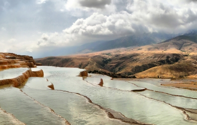

# Multi-CAST Persian

## How to cite

If you use these data please cite
- the original source
  > Adibifar, Shirin. 2016. Multi-CAST Persian. In Haig, Geoffrey & Schnell, Stefan (eds.), Multi-CAST: Multilingual corpus of annotated spoken texts. Version 1606. Bamberg: University of Bamberg. (multicast.aspra.uni-bamberg.de/#persian) (date accessed)
- the derived dataset using the DOI of the [particular released version](../../releases/) you were using



## Description


**Persian** ([tehr1242](https://glottolog.org/resource/languoid/id/tehr1242)) is an Iranian language with official variants spoken in Iran, Afghanistan, and parts of Tajikistan; the variety spoken in Iran is also referred to as Farsi.

The texts in this corpus are narrative retellings of the *Pear film* ([Chafe 1980](Source#cldf:chafe1980)), a roughly five minute-long short film about a boy stealing the fruit a man had been picking. The recordings were made by Shirin Adibifar in Tehran and locations in the province of Mazandaran in 2015. Of the 29 speakers in this corpus, 17 are female and 12 male. The median age is 25, with a range of 20 to 39. All speakers have received at least some measure of university-level education.

This dataset is licensed under a CC-BY-4.0 license

Available online at https://multicast.aspra.uni-bamberg.de/#persian


```geojson
{
    "type": "FeatureCollection",
    "features": [
        {
            "type": "Feature",
            "geometry": {
                "type": "Point",
                "coordinates": [
                    53.3,
                    32.9
                ]
            }
        },
        {
            "type": "Feature",
            "geometry": {
                "type": "Polygon",
                "coordinates": [
                    [
                        [
                            48.3,
                            37.9
                        ],
                        [
                            58.3,
                            37.9
                        ],
                        [
                            58.3,
                            27.9
                        ],
                        [
                            48.3,
                            27.9
                        ],
                        [
                            48.3,
                            37.9
                        ]
                    ]
                ]
            }
        }
    ]
}
```


## Corpus counts

Only a small number of basic GRAID symbols are counted:

*Function symbols*
- ⟨0⟩ zero
- ⟨pro⟩ definite pronoun
- ⟨np⟩ full noun phrase
- ⟨other⟩ form not further specified

*Person/Animacy symbols*
- ⟨.1⟩ first person
- ⟨.2⟩ second person
- ⟨.h⟩ third person, human
- ⟨.d⟩ third person, anthropomorphic
- ø third person, non-human

*Function symbols*
- ⟨:s⟩ subject of an intransitive clause
- ⟨:a⟩ subject of a transitive clause
- ⟨:ncs⟩ non-canonical subject
- ⟨:p⟩ direct object
- ⟨:obl⟩ oblique argument
- ⟨:g⟩ goal argument
- ⟨:l⟩ locational argument
- ⟨:pred⟩ predicate
- ⟨:poss⟩ possessive
- ⟨:other⟩ function not further specified

Only basic categories are listed; categories represented by complex symbols with additional
specifiers (e.g. ⟨dem_pro⟩ ‘demonstrative pronoun’) have been subsumed under the more basic
category (e.g. ⟨pro⟩ ‘definite pronoun’). Please refer to the annotation notes for this corpus for
information on all annotated categories, including those not listed here.

| GRAID | ⟨:s⟩ | ⟨:a⟩ | ⟨:ncs⟩ | ⟨:p⟩ | ⟨:obl⟩ | ⟨:g⟩ | ⟨:l⟩ | ⟨:pred⟩ | ⟨:poss⟩ | ⟨:other⟩ | totals |
|:--------------|-------:|-------:|---------:|-------:|---------:|-------:|-------:|----------:|----------:|-----------:|---------:|
| **⟨0.1⟩** | 9 | 20 | 0 | 0 | 0 | 0 | 0 | 0 | 0 | 0 | 29 |
| **⟨0.2⟩** | 0 | 1 | 0 | 0 | 0 | 0 | 0 | 0 | 0 | 0 | 1 |
| **⟨0.h⟩** | 273 | 428 | 24 | 1 | 0 | 1 | 0 | 0 | 0 | 0 | 727 |
| **⟨0.d⟩** | 0 | 0 | 0 | 0 | 0 | 0 | 0 | 0 | 0 | 0 | 0 |
| **⟨0⟩** | 32 | 15 | 0 | 91 | 0 | 0 | 0 | 0 | 0 | 0 | 138 |
| **⟨pro.1⟩** | 1 | 1 | 0 | 0 | 0 | 0 | 0 | 0 | 0 | 0 | 2 |
| **⟨pro.2⟩** | 0 | 0 | 0 | 0 | 0 | 0 | 0 | 0 | 2 | 0 | 2 |
| **⟨pro.h⟩** | 40 | 44 | 2 | 50 | 26 | 42 | 25 | 0 | 283 | 0 | 512 |
| **⟨pro.d⟩** | 0 | 0 | 0 | 0 | 0 | 0 | 0 | 0 | 0 | 0 | 0 |
| **⟨pro⟩** | 19 | 0 | 0 | 31 | 7 | 2 | 3 | 0 | 7 | 0 | 69 |
| **⟨np.1⟩** | 0 | 0 | 0 | 0 | 0 | 0 | 0 | 0 | 1 | 0 | 1 |
| **⟨np.2⟩** | 0 | 0 | 0 | 0 | 0 | 0 | 0 | 0 | 0 | 0 | 0 |
| **⟨np.h⟩** | 181 | 73 | 3 | 22 | 19 | 8 | 8 | 11 | 26 | 0 | 351 |
| **⟨np.d⟩** | 0 | 0 | 0 | 0 | 0 | 0 | 0 | 0 | 0 | 0 | 0 |
| **⟨np⟩** | 160 | 9 | 0 | 310 | 137 | 45 | 221 | 14 | 18 | 12 | 926 |
| **⟨other.1⟩** | 0 | 0 | 0 | 0 | 0 | 0 | 0 | 0 | 0 | 0 | 0 |
| **⟨other.2⟩** | 0 | 0 | 0 | 0 | 0 | 0 | 0 | 0 | 0 | 0 | 0 |
| **⟨other.h⟩** | 0 | 0 | 0 | 0 | 0 | 0 | 0 | 0 | 0 | 0 | 0 |
| **⟨other.d⟩** | 0 | 0 | 0 | 0 | 0 | 0 | 0 | 0 | 0 | 0 | 0 |
| **⟨other⟩** | 0 | 0 | 0 | 3 | 0 | 1 | 19 | 37 | 0 | 0 | 60 |
| | 715 | 591 | 29 | 508 | 189 | 99 | 276 | 62 | 337 | 12 | 2818 |


**Clause boundaries**

| GRAID | count |
|:-----------|--------:|
| **⟨##⟩** | 0 |
| **⟨#⟩** | 1417 |
| **totals** | 1417 |


## Corpus metadata

- [Annotation notes](cldf/media/annotation-notes.pdf)
- [Metadata](cldf/media/metadata.pdf)
- [Translated texts](cldf/media/translated-texts.pdf)


## CLDF Datasets

The following CLDF datasets are available in [cldf](cldf):

- CLDF [TextCorpus](https://github.com/cldf/cldf/tree/master/modules/TextCorpus) at [cldf/TextCorpus-metadata.json](cldf/TextCorpus-metadata.json)